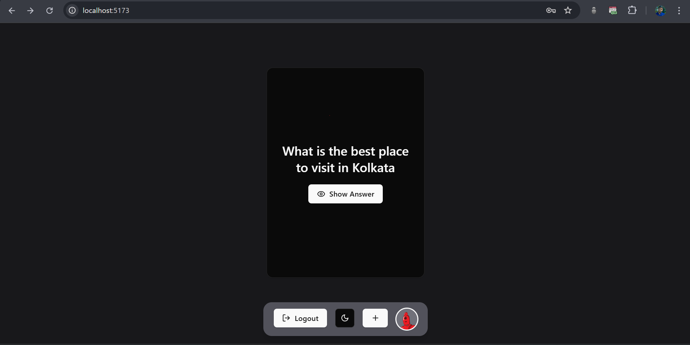
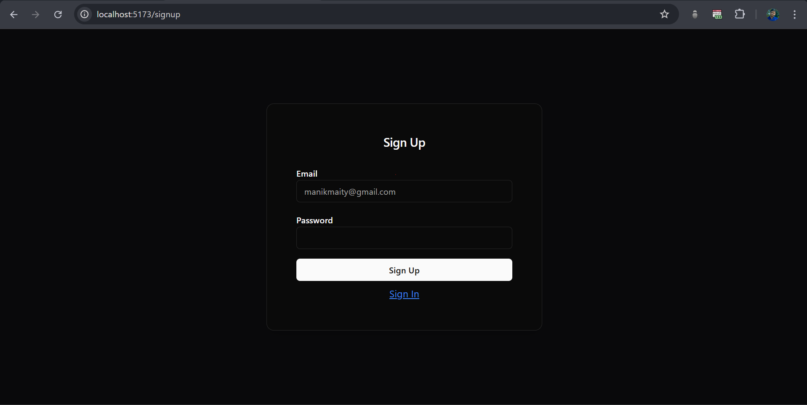
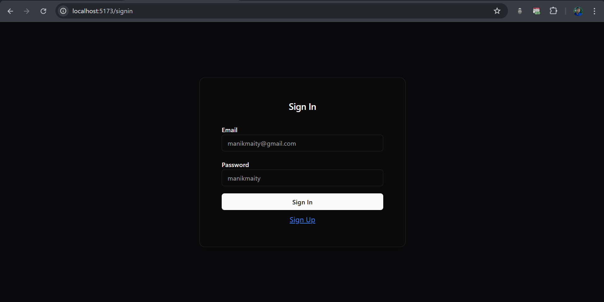

<div align="center">
    <h1>Flashcard Learning App with Leitner System</h1>
</div>

📚 The **Flashcard Learning App** is built using the MERN stack and incorporates the **Leitner System**, a powerful spaced repetition technique for effective learning. Users can create, review, and progress through flashcards based on their performance.

## 🚀 Features

- **User Authentication:** Sign up and log in securely.
- **Flashcard Management:** Create, update, delete, and review flashcards.
- **Leitner System Integration:**
  - Flashcards start in **Box 1**.
  - If answered correctly, they move to the **next box**.
  - If answered incorrectly, they return to **Box 1**.
  - Higher boxes have **longer review intervals**.
  - Box 1 → 1 days, Box 2 → 3 days, Box 3 → 7 days, Box 4 → 14 days, Box 5 → 30 days.
- **Dark & Light Mode Support** for a better user experience.
- **Smooth UI/UX:** Implemented using **Framer Motion** for transitions.
- **Mobile-Responsive Design** to support all devices.

## Preview

### Home Page



### Sign Up Page


### Sign In Page


## Live Website
- [Live Website](https://alfredtask-theta.vercel.app/) (May take time to load initially because backend is hosted on render for free)

## 🏗 Tech Stack

### Frontend
- `React.js`, `TailwindCSS`, `ShadCN UI`, `Axios`, `React Query`, `Framer Motion`, `Zustand`

### Backend
- `Express.js`, `MongoDB`, `Mongoose`, `JWT` , `Bcrypt` , `Zod` , `HTTP-Status-Codes`

## 🔗 API Endpoints
### Authentication
- **POST** `/user/signup` → Create a new user
- **POST** `/user/signin` → Log in a user

### Flashcards
- **POST** `/flashcards` → Add a new flashcard
- **GET** `/flashcards` → Fetch all today's flashcards
- **PUT** `/flashcards/:id` → Move to the next level
- **DELETE** `/flashcards/:id` → Delete a flashcard


## 🛠️ Installation & Setup

### Prerequisites
- Node.js and npm/yarn installed.
- MongoDB set up locally or on a cloud provider.

### Steps

1. **Clone the Repository**
   ```bash
   git clone https://github.com/ManikMaity/ALFREDTASK.git
   cd ALFREDTASK
   ```

2. **Backend Setup**
   ```bash
   cd backend
   npm install
   ```
   - Create a `.env` file in the root and add:
     ```env
     PORT=3000
     NODE_ENV="development"
     DEV_DB_URL="your-mongodb-url"
     SALT_ROUND=7
     JWT_SECRET="your-secret-key"
     JWT_EXPIRES_IN="1y"
     FRONTEND_URL="http://localhost:5173"
     ```
   - Start the server:
     ```bash
     npm run dev
     ```

3. **Frontend Setup**
   ```bash
   cd frontend
   npm install
   ```
   - Create a `.env` file in the root and add:
     ```env
     VITE_BACKEND_URL="http://localhost:3000/api"
     ```
   - Start the development server:
     ```bash
     npm run dev
     ```

4. **Access the Application**
   - Open `http://localhost:5173` in your browser.

## 📌 Usage
1. **Sign Up / Log In**
2. **Review Today’s Flashcards**
3. **Mark Answers as Correct or Incorrect**
4. **Create & Update Flashcards**

